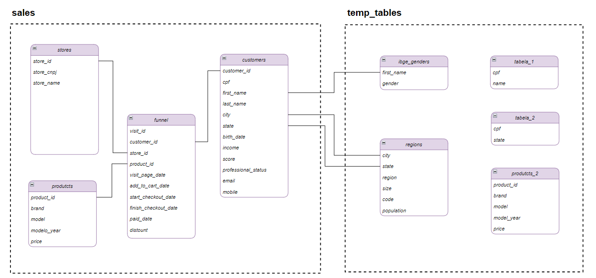

# Análise de Dados com SQL e Excel

Projeto de análise de dados utilizando PostgreSQL e Excel com base em um banco de dados de e-commerce automotivo.

## 📊 Objetivo
Analisar métricas de negócio como receita, leads, conversão e ticket médio, além de explorar o perfil de clientes e comportamento de produtos.

## 🗄️ Estrutura do Banco de Dados

## 🛠️ Ferramentas utilizadas
- PostgreSQL
- SQL
- Excel

## 📁 Estrutura do Projeto

### Projeto 1 - Análise de Vendas
- Análise de receita, ticket médio, leads e conversão
- Desempenho por estado, marcas, visitas e lojas
- Dashboard no Excel com visualização de métricas

### Projeto 2 - Análise de Clientes e Produtos
- Segmentação de clientes (idade, renda, gênero e status profissional)
- Análise de comportamento e classificação de veículos
- Geração de insights a partir dos dados

## 🚀 Técnicas utilizadas
- Joins
- Subqueries
- CTEs
- Funções de agregação
- CASE WHEN

## 📌 Resultado
Geração de insights a partir dos dados para apoio à tomada de decisão.
